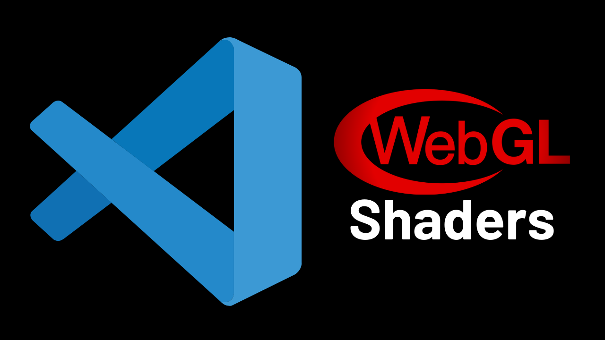
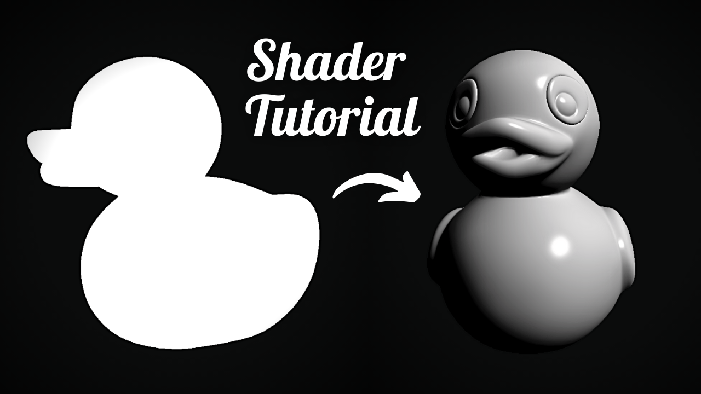

# 🎨 Shader Tutorials

The code for my shader tutorials on YouTube.

## Tutorials

### 0. Intro to Shaders

### 1. Phong Lighting

### 2. Circle SDF

### 3. Value Noise

### 4. Voronoi Noise

### 5. Perlin Noise

### 6. FBM, Domain Warping, Normals

### 7. Ray Marching

### 8. Checkerboard

### 9. Gaussian Blur

## Helpful Resources

- Tutorials

  - [Inigo Quilez's Articles](https://iquilezles.org/articles/)
  - [Ronja's Shader Tutorials](https://ronja-tutorials.com/)
  - [Catlike Coding's Unity Tutorials](https://catlikecoding.com/unity/tutorials/)
  - [Patricio Vivo's The Book of Shaders](https://thebookofshaders.com/)
  - [Michael Walczyk's Ray Marching Tutorial](https://michaelwalczyk.com/blog-ray-marching.html)

- YouTube Channels

  - [Simon Dev](https://www.youtube.com/@simondev758)
  - [Inigo Quilez](https://www.youtube.com/@InigoQuilez)
  - [The Art of Code](https://www.youtube.com/@TheArtofCodeIsCool)

- Websites

  - [Shadertoy](https://www.shadertoy.com/)
